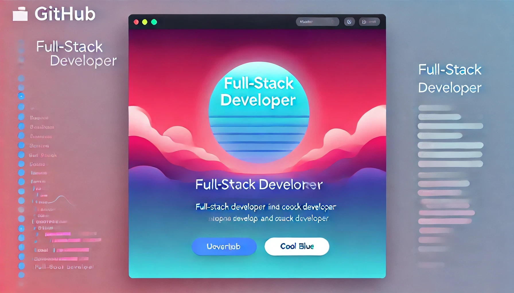

## Hi there, I'm Catlina 👋 

## 🔭 I’m currently working on Web3

## [人格](https://www.16personalities.com/profiles/3e39805b85ca8)
| Personality Type      | `Mind`        | `Energy`        | `Nature`    | `Tactics`     | `Identity`    | `Test taken` |
|-----------------------|---------------|-----------------|-------------|---------------|---------------|--------------|
| Protagonist( ENFJ-A ) | 86% Intuitive | 79% Extraverted | 60% Feeling | 51% Judging   | 54% Assertive | 2024-3-27    |

## 在做的事

- Web3技术研究`野生动物猎食`
- 某Web3、AI、DePIN公司开发者`币已上所`
- Web3未来的探索`终此一生`

## 找到我的方式
[✈️飞机](https://t.me/groue_juice)@Telegram
[📮邮箱](mailto:catlina186@gmail.com)@Gmail

## 技术栈
- Javascript、Typescript、AssemblyScript、Rust、Nodejs、Python
- React、Vue、Vite、Webpack、ThinkJs、Nest、Midway、Express、KOA
- MongoDB、MySQL、Postgres、SQLite、WebDB、IndexDB
- Web3、Ethers、Solidity、Hardhat、Truffle、Solana-web3、Anchor、Move、Tact
- GraphQL、RPC2.0、WSS
- Three.js、WebGL、Unity3d、Layer3d
- Nginx、Shell
- PS、PR、剪映

## 擅长
- 领导团队开发各种任务，制定合理架构保证系统稳定运行以及方便开发
- 经历数家大中小型公司，汲取了大量项目的成功与失败经验
- 深入了解电商、短视频等矩阵打法
- 学习新知识，充实自己的同时不落伍于时代

## 爱好
- 参加黑客松、技术展览、IT峰会
- 台球、篮球、游泳、小提琴
- 结识有志之士
